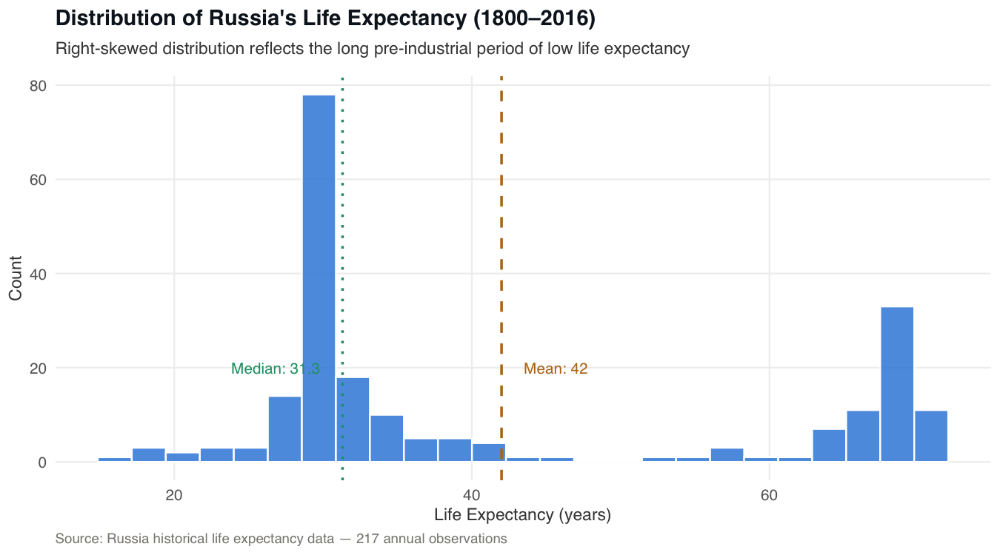
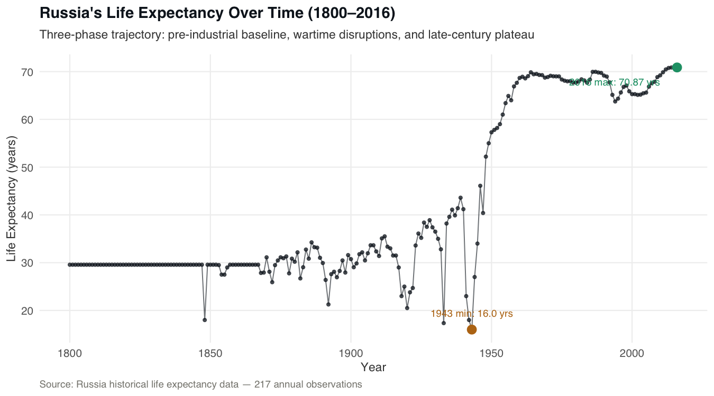
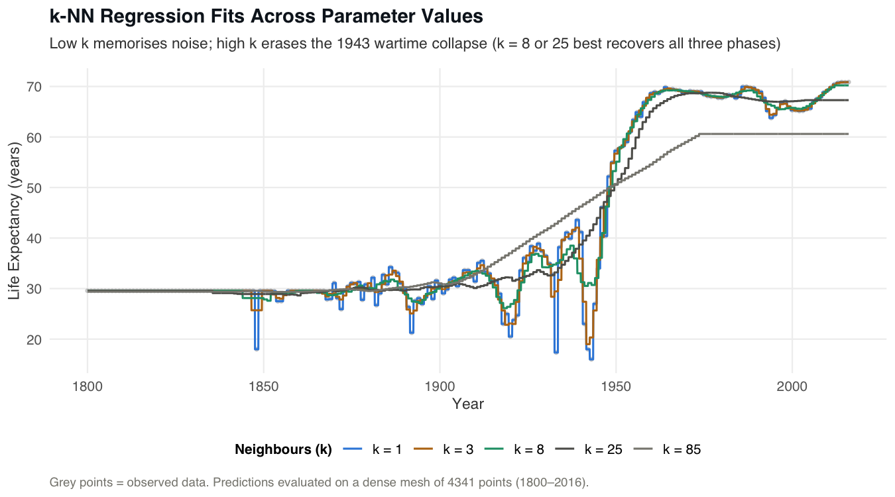
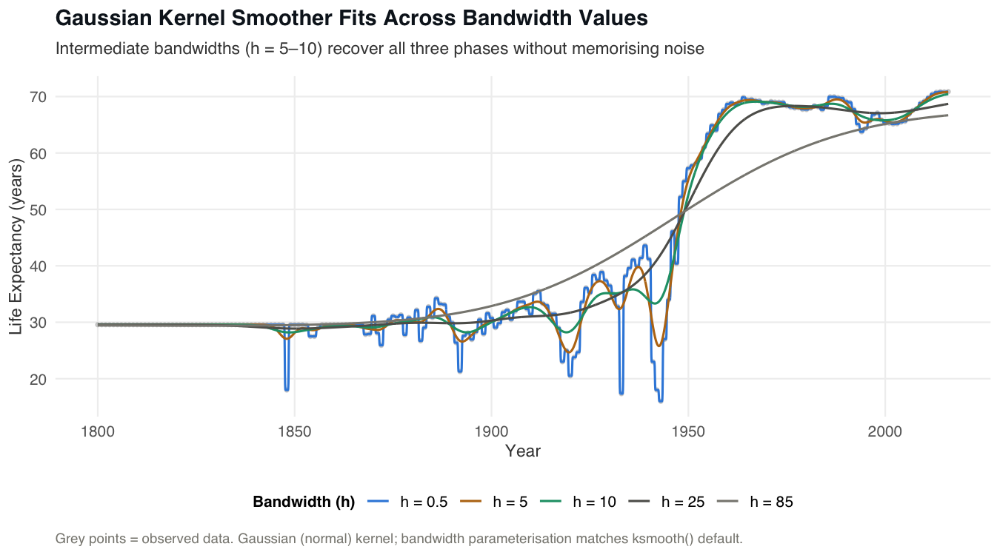
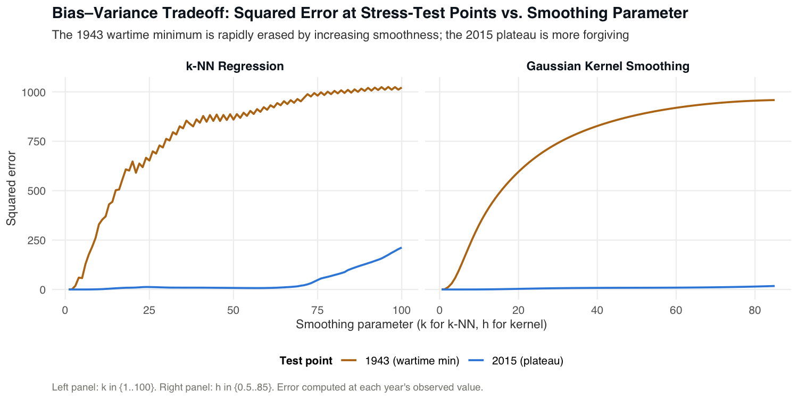

# 📌 Life Expectancy Trend Modeler

> Applies k-NN regression and Gaussian kernel smoothing to 217 years of Russian life expectancy data to demonstrate the bias-variance tradeoff in non-parametric smoothing.

## 📖 Overview
 - Implements k-Nearest Neighbours regression and Gaussian kernel smoothing to model Russia's annual life expectancy from 1800 to 2016 — a non-monotone, three-phase time series that linear methods cannot represent without manual segmentation.
 - Evaluates ten parameter configurations (k ∈ {1, 3, 8, 25, 85}; h ∈ {0.5, 5, 10, 25, 85}) and uses the 1943 wartime collapse (actual: 16.00 years) as a stress-test point to expose the consequences of over- and under-smoothing.
 - Developed as a reproducible R Markdown document rendered with knitr, with all dependencies managed via renv for consistent results across environments.
 - Gaussian kernel smoothing is recommended over k-NN for this dataset due to its distance-weighted averaging, superior boundary behaviour at 1800 and 2016, and greater robustness in the data-sparse pre-1850 period.

## 🏢 Business Impact
Organizations that model long-term demographic or time-series data face the same core challenge demonstrated here: choosing a smoothing parameter that preserves structurally important events without fitting noise. This project provides a concrete, reproducible benchmark showing how k-NN and kernel smoothing degrade at parameter extremes — insight directly applicable to forecasting pipelines in public health, actuarial modelling, and policy analysis where missing a historical discontinuity carries real risk.

## 🚀 Features
✅ **Bias–Variance Stress Test:** Uses the 1943 wartime minimum (16.00 years) as a single-point stress test, quantifying how rapidly each method erases a historically significant discontinuity as smoothing increases.  
✅ **Dual-Method Comparison:** Runs k-NN regression and Gaussian kernel smoothing side-by-side across matched parameter ranges, enabling direct apples-to-apples evaluation of their tradeoff curves.  
✅ **Dense Prediction Mesh:** Generates predictions on a 4,341-point mesh (≈20× the training set) to produce smooth visualisation curves and precise pointwise MSE estimates at any target year.  
✅ **Reproducible R Markdown Pipeline:** Single `analysis.Rmd` file covers data loading, EDA, preprocessing, model training, evaluation, and figure export — rendering to a self-contained HTML report with floating TOC.  
✅ **Five Publication-Ready Figures:** Automatically saves distribution, time-series, k-NN fit, kernel fit, and bias-variance tradeoff plots to `figures/` at 150 dpi with a consistent portfolio theme.  

## ⚙️ Tech Stack
| Technology                  | Purpose                                                          |
| --------------------------- | ---------------------------------------------------------------- |
| `R`                         | Primary language for all analysis, modelling, and visualisation  |
| `FNN`                       | Provides `knn.reg()` for k-nearest neighbours regression         |
| `ggplot2`                   | All five figures, with a custom `theme_portfolio` applied        |
| `dplyr`                     | Data wrangling and summary statistics                            |
| `tidyr`                     | Reshaping bias-variance error data from wide to long format      |
| `ksmooth`                   | Base R Gaussian kernel smoother used for all kernel fits         |
| `rmarkdown`                 | Reproducible analysis document rendered to HTML                  |
| `knitr`                     | Code chunk execution and document knitting                       |
| `renv`                      | Dependency snapshot and restoration for reproducibility          |

## 📂 Project Structure
<pre>
📦 Life Expectancy Trend Modeler
 ┣ 📂 data
 ┃ ┗ 📂 raw
 ┃   ┣ 📜 LER.csv
 ┃   ┗ 📜 README.md
 ┣ 📂 figures
 ┃ ┣ 📜 01_life-expectancy-distribution.png
 ┃ ┣ 📜 02_time-series-raw.png
 ┃ ┣ 📜 03_knn-fits-comparison.png
 ┃ ┣ 📜 04_kernel-fits-comparison.png
 ┃ ┗ 📜 05_bias-variance-tradeoff.png
 ┣ 📜 LICENSE
 ┣ 📜 analysis.Rmd
 ┗ 📜 README.md
</pre>

> **Why `.Rprofile`?** This file activates the `renv` environment automatically when R starts in the project directory, ensuring that `renv::restore()` is the only step needed to reproduce the exact package versions used in the analysis.

## 🛠️ Installation

1️⃣ **Clone the repository**
<pre>
git clone https://github.com/real-ahmed-moussa/letm.git
cd letm
</pre>

2️⃣ **Install renv and restore dependencies**
<pre>
install.packages("renv")
renv::restore()
</pre>

3️⃣ **Render the analysis**
<pre>
rmarkdown::render("analysis.Rmd")
</pre>

The rendered HTML report and all five figures will be saved automatically. `set.seed(42)` is used throughout; minor numerical variation across R versions is expected.

## 📂 Figures

### Distribution of Russia's Life Expectancy (1800–2016)

  

### Raw Time Series (1800–2016)

  

### k-NN Regression Fits Across Parameter Values

  

### Gaussian Kernel Smoother Fits Across Bandwidth Values

  

### Bias–Variance Tradeoff: Squared Error at Stress-Test Points

  

## 📊 Results
 - **Task:** Non-parametric regression on a 217-observation univariate time series (Year → Life Expectancy) with a structurally non-monotone, three-phase response.
 - **Stress-test MSE at 1943 (wartime minimum, actual: 16.00 yrs):** k-NN at k = 85 → MSE = 995.96; Gaussian kernel at h = 85 → MSE = 959.82 — both methods miss by ~32 years under maximum smoothing.
 - **Plateau MSE at 2015 (actual: 70.83 yrs):** k-NN at k = 85 → MSE = 104.54, confirming that the plateau is more forgiving of over-smoothing than the wartime collapse.
 - **Optimal parameter range:** k = 8–25 and h = 5–10 best recover all three structural phases without memorising noise or erasing the 1943 disruption.
 - **Preferred method:** Gaussian kernel smoothing — lower MSE at the critical stress-test point, no boundary-flattening artefacts at 1800/2016, and better handling of the data-sparse pre-1850 period.

## 📝 License
This project is shared for portfolio purposes only and may not be used for commercial purposes without permission.
